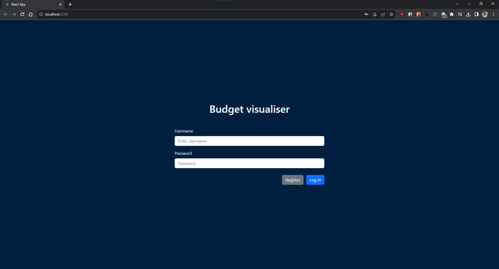
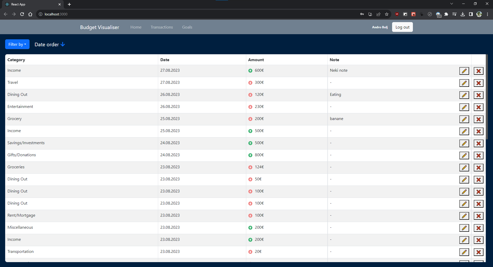

# data-visualization
Data visualization in React

Projekt za završni rad - Andro Bulj

# Login ekran
Kad se uđe u aplikaciju korisniku je prikazan Login ekran na kojem se može prijaviti sa svojim računom u aplikaciju koristeći postavljeni username i password. Ako nema računa klikom na Register ga vodi na ekran za registraciju, a sa Log in se prijavljuje. Ukoliko su krivo uneseni podatci prikazuje se na ekranu poruka da je krivo uneseno ili da korisnik ne postoji.

# Register ekran
Ekran za registraciju korisnika. Može se unijeti ime i prezime, username i password sa kojim se prijavljuje. Nakon uspješne registracije preusmjerava se na login ekran gdje se može logirati sa registriranim username i passwordom. Ukoliko se pokuša registrirati sa već postojećim usernameom prikaže se poruka.

# Home ekran
Ekran koji se odmah prikaže nakon prijave u aplikaciju. 

Na vrhu se nalazi navigacijska traka svijetlo plave boje. Na lijevoj strani se nalazi naziv aplikacije i linkovi na različite ekrane aplikacije, a desno se nalazi ime i prezime logiranog korisnika te gumb za odjavu koji vodi korisnika na login ekran. Na Home ekranu su prikazani grafovi koji sadrže analizirane podatke korisnika što ih je unio tijekom njegovog korištenja aplikacije. 

Gornji lijevo graf prikazuje totalne prihode, rashode ili kombinirano tijekom određenog perioda. Ispod njega se nalaze izbornici, lijevim se odabire razdoblje prikazanih podataka, opcije su ove ili predhodne godine po mjesecu, ili ovog ili predhodnog mjeseca po danu. Desno od njega izbornih ima opcije prihodi, rashodi ili kombinirano. Desno od tih izbornika se nalaze gumbovi pomoću kojih se odabire tip grafa koji će se prikazati. Imamo opciju područnog, linijskog ili stupičastog grafikona. Prema tome koje su opcije odabrane u naslovu grafa su prikazani detalji.

Ispod se nalazi graf koji prikazuje top 5 kategorija po totalnim prihodima ili rashodima, zavisi što je odabrano u izborniku. Također se može klikom na plavi gumb odabrati tip grafikona, opcije su mrežni dijagram ili tortni grafikon.

Na desnoj strani na vrhu se nalazi unos nove transakcije. Može se odabrati jedna od ponuđenih kategorija u izborniku, unijeti iznos i označiti je li prihod ili rashod, datum transakcije i zabilješka o transakciji. Na gumb Cancel se poništava unos, a ako je sve unešeno pravilno na gumb Add se dodaje nova transakcija i grafovi se ažuriraju.

Ispod unosa nove transakcije se nalazi kombinirani stupičasti i linijski graf koji prikazuje podatke o ciljevima koje je korisnik postavio i izvršio. Stupac prikazuje broj dana koliko je trebalo da se dođe do cilja, a linija prosječno koliko je ušteđeno po danu. 

# Transactions ekran
Ekran koji u tablici prikazuje sve do sada unesene transakcije.

Poviš tablice se nalazi izbornik koji sadrži sve kategorije koje je korisnik unio te se klikom na njih prikaže samo ta odabrana kategorija ili se odabere opcija da se ne filtrira. Pored se nalazi Date order te klikom na njega se mijenja sortiranje transakcija u tablici silazno ili uzlazno.

U tablici su prikazani redom kategorija, datum transakcije, iznos sa ikonom pored s obzirom je li rashod ili prihod i zabilješka transakcije koja se može uređivati klikom na ikonu olovke. Na crveni gumb X se briše transakcija.

#Goals ekran
Ekran koji služi za praćenje i postavljanje ciljeva za štednju. 

Pri vrhu ekrana imamo unos za iznos i naslov cilja te klikom na Add new goal se dodaje novi cilj. Novi cilj je prikazan ispod te se može dodavati i oduzimati od ukupne količine u svrhu praćenja. Kada se dosegne preko 100% od cilja se može izvršiti, umjesto gumba Delete se pojavi gumb Complete sa kojim se završava cilj i ide na desnu stranu svih završenih ciljeva. 

Na desnoj strani su prikazani svi ciljevi koji su završeni sa nazivom, iznosom i datumom od kada do kada je cilj završen. Klikom na crveni X se briše završeni cilj.

